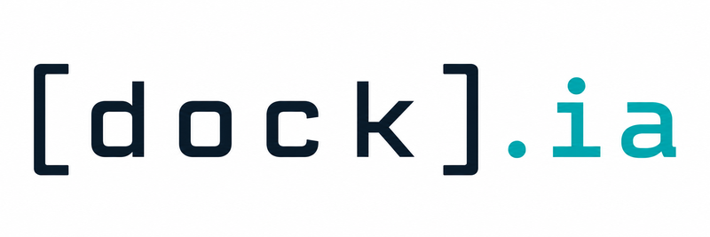

# dock.ia

<p align="center">
  
</p>

## What it is and why

dock.ia builds a Docker image from an existing base image and adds AI-assisted development tools for the normal user inside the container.

The goal is to keep the base image separate from the AI tooling. You start with a base image that already contains your main development environment, and dock.ia creates a derived image that keeps that environment while adding tools such as Bun, pnpm, context-mode, context7-mcp, and RTK.

This avoids installing the same tools by hand in every container and makes the resulting environment easier to reproduce.

## Description

This repository contains these files:

- `Dockerfile.ai-tools`: defines the derived image. The root phase installs system packages, Node.js, Corepack, and pnpm. The user phase installs AI tools under the `HOME` directory defined by the base image for the selected user.
- `build_ai_image.sh`: runs `docker buildx build` with the required build arguments.
- `install_ai_tools_root.sh`: installs system dependencies and prepares pnpm.
- `install_ai_tools_user.sh`: installs user-level tools and writes the required `PATH` entries into the selected shell rc file.
- `.pre-commit-config.yaml`: configures standard checks, shell formatting with `shfmt`, and Conventional Commits validation.

### Requirements

You need Docker with `buildx` available on the machine that builds the image.

The base image must contain the user you want to use as the main container user. dock.ia uses `dev` as the default user.

### Shell startup files

The user installer does not write the full `PATH` setup directly into the selected shell rc file. Instead, it creates a companion file by appending `.ai` to the rc file name. For example, if the selected rc file is `${HOME}/.bashrc`, the installer creates `${HOME}/.bashrc.ai`.

That generated `.ai` file exports `BUN_INSTALL`, exports `PNPM_HOME`, and prepends the user-local tool directories to `PATH`.

The selected rc file only receives one source line:

```bash
[ -f "${HOME}/.bashrc.ai" ] && . "${HOME}/.bashrc.ai"
```

### Step by step

1. Enter the project directory:

   ```bash
   cd dock.ia
   ```

2. Build a derived image:

   ```bash
   ./build_ai_image.sh <base_image> <target_image>
   ```

3. If the main user in the base image is not `dev`, pass it as the third argument:

   ```bash
   ./build_ai_image.sh ubuntu:24.04 my-ai-image:latest developer
   ```

4. Run the resulting image:

   ```bash
   docker run --rm -it my-ai-image:latest
   ```

5. Inside the container, verify that the tools are available:

   ```bash
   node --version
   pnpm --version
   bun --version
   rtk --version
   context-mode doctor
   ```

## Examples

Build an image using the default options:

```bash
./build_ai_image.sh my-base:latest my-base-ai:latest
```

Build an image for a base image where the main user is named `developer`:

```bash
./build_ai_image.sh my-base:latest my-base-ai:latest developer
```

Pass an explicit rc file if your base image uses a different Bash startup file:

```bash
./build_ai_image.sh my-base:latest my-base-ai:latest developer .profile
```

Use a different build context:

```bash
./build_ai_image.sh my-base:latest my-base-ai:latest developer .profile /path/to/dock.ia
```

## Tool configuration

The resulting image installs RTK and context-mode, but those tools still need their own configuration files and usage instructions. Read the upstream projects before deciding which files to mount and where they should live inside the container:

- context-mode: [https://github.com/mksglu/context-mode](https://github.com/mksglu/context-mode)
- RTK AI: [https://github.com/rtk-ai/rtk](https://github.com/rtk-ai/rtk)

A practical way to run the resulting image is through a `docker-compose.yml` file that mounts configuration files from the host into the container. The host paths in this example use `${XDG_CONFIG_HOME}` only as one possible layout; adapt them to your machine. The container paths show where the tools or editors would see those files when the default user is `dev`.

```yaml
services:
  dock-ia:
    image: my-base-ai:latest
    working_dir: /home/dev/<workspace>
    volumes:
      - ${XDG_CONFIG_HOME}/codex:/home/dev/.codex
      - ${XDG_CONFIG_HOME}/rtk:/home/dev/.config/rtk
      - ${XDG_CONFIG_HOME}/copilot/hooks:/home/dev/.github/hooks
      - ${XDG_CONFIG_HOME}/copilot/copilot-instructions.md:/home/dev/.github/copilot-instructions.md
      - ${XDG_CONFIG_HOME}/vscode/mcp.json:/home/dev/<workspace>/.vscode/mcp.json
```

The example maps configuration files from known locations on the host into the locations expected inside the container. The exact container paths depend on the tools you use, the container user, and the workspace directory, so check the RTK and context-mode documentation before treating these mounts as final.
